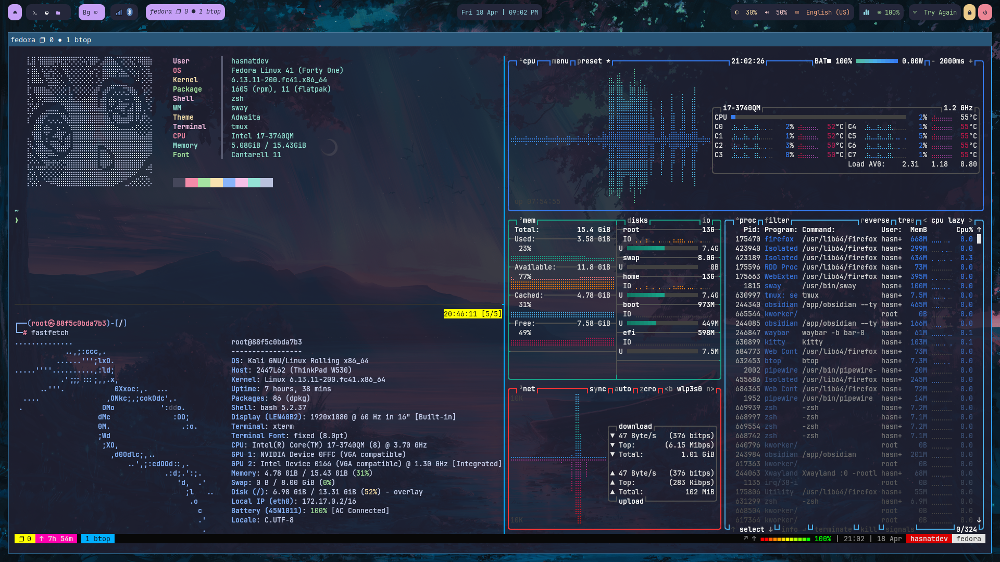
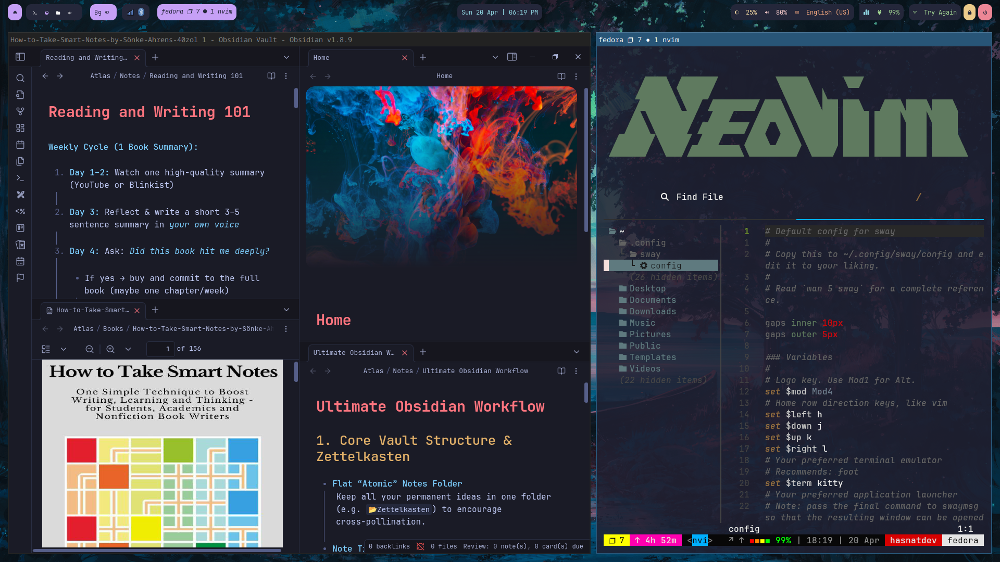

# 🧰 Hasnat's Dotfiles

Welcome to my personal dotfiles! This repository contains the configuration files and setup script for my development environment based on **Fedora Sway Spin**.

> ⚠️ These dotfiles are primarily intended for Fedora Sway Spin only.

## 📸 Screenshots

<!-- Add your screenshots here -->




---

## 🚀 Features
- 🔩 Modular and organized dotfiles
- 🖥️ Configurations for terminal, editor, and window manager
- 🧠 Zsh with Starship prompt + Zinit plugin manager
- 🪟 Sway window manager and Waybar config
- 🧼 Fully automated setup script with interactive prompts

---

## 📁 Structure
```bash
.
├── kitty/           # Kitty terminal config
├── rofi/            # Rofi launcher config
├── sway/            # Sway window manager config
├── waybar/          # Waybar status bar config
├── tmux/            # Tmux configuration
├── nvim/            # Neovim config (LazyVim)
├── zsh/             # Zsh custom configs
├── .zshrc           # Main Zsh config
├── setup.sh         # Auto setup script
└── README.md        # You're reading this
```

---

## 📦 What It Installs

The setup script installs and configures:

### 🛠 Core Tools
- `kitty`, `rofi`, `waybar`, `zsh`, `zoxide`, `tmux`, `bat`, `fastfetch`, `htop`, `pyfiglet`, `lolcat`, `firefox`, `fzf`, `eza`, `zstd`, `flatpak`, `snapd`, `cargo`, `git`, `rsync`, `wget`, `unzip`

### 🧩 Extras
- [`Zinit`](https://github.com/zdharma-continuum/zinit) (Zsh plugin manager)
- [`Starship`](https://starship.rs) (blazing-fast prompt)
- [`LazyGit`](https://github.com/jesseduffield/lazygit)
- [`LazyDocker`](https://github.com/jesseduffield/lazydocker)
- [`Yazi`](https://github.com/sxyazi/yazi) (TUI file manager)
- [`JetBrainsMono Nerd Font`](https://www.nerdfonts.com/font-downloads)

---

## 🧪 Setup Instructions

### 1. Clone the repository
```bash
git clone https://github.com/hasnatsafdar/Dotfiles.git
cd Dotfiles
```

### 2. Run the installer
```bash
chmod +x setup.sh
./setup.sh
```

The script will:
- Ask you before installing packages or overwriting config files
- Install all tools and dependencies
- Copy all dotfiles into your system’s `~/.config/` directory

---

## 🧠 Why I Made This
This repo is my attempt to organize years of scattered configurations, tools, and experiments into one clean system — easily reproducible and sharable. Most configurations are adapted from open-source projects, tweaked to my liking, and documented for clarity.

---

## 📬 Credits & Inspirations
- LazyVim
- Oh My Tmux
- Nerd Fonts
- Zinit + Starship
- The Linux and r/unixporn communities 💖

---

## ✅ To-Do (Coming Soon)
- [ ] Add install script for Obsidian, Anki, AppFlowy, Docker, and Rust
- [ ] Make this cross-distro compatible (Arch, Debian)
- [ ] Create separate branches/tags for minimal vs full setups

---

## 🙏 License
Feel free to fork and use anything you like. Contributions are welcome!

---

Enjoy! 🚀

